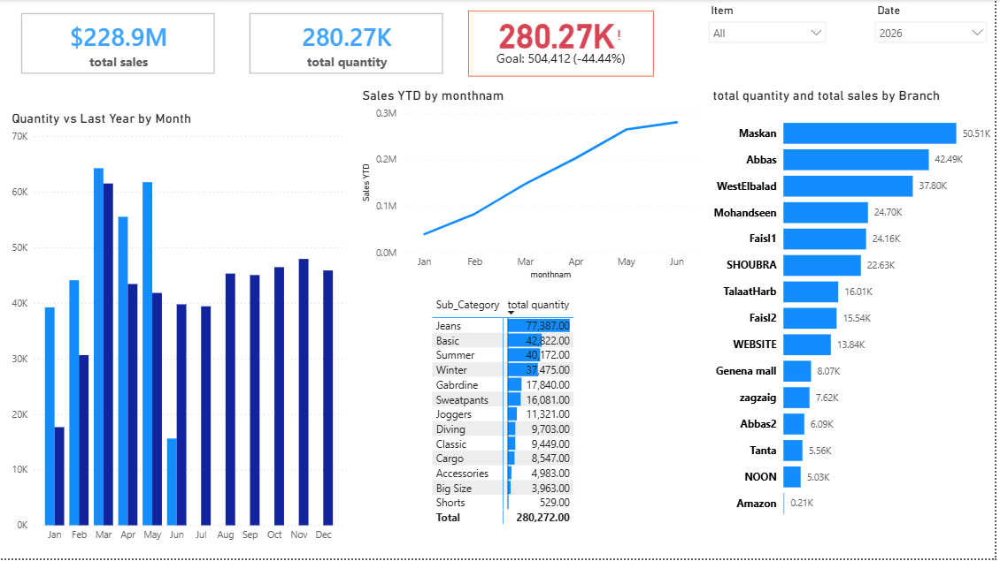

# Sales Performance & Quantity Analysis Dashboard

## 📊 Dashboard Preview

## 🎯 Project Overview
This Power BI dashboard provides a comprehensive analysis of sales performance, quantities sold, and target tracking across various retail branches and product sub-categories.

## 🛠️ Technical Skills Applied
* **Data Cleaning & Transformation:** Standardized branch names, cleared prefix codes from sub-categories, and formatted dates using Power Query.
* **DAX Calculations:** Formulated custom measures for Time Intelligence, including Sales YTD and Quantity vs Last Year comparison.
