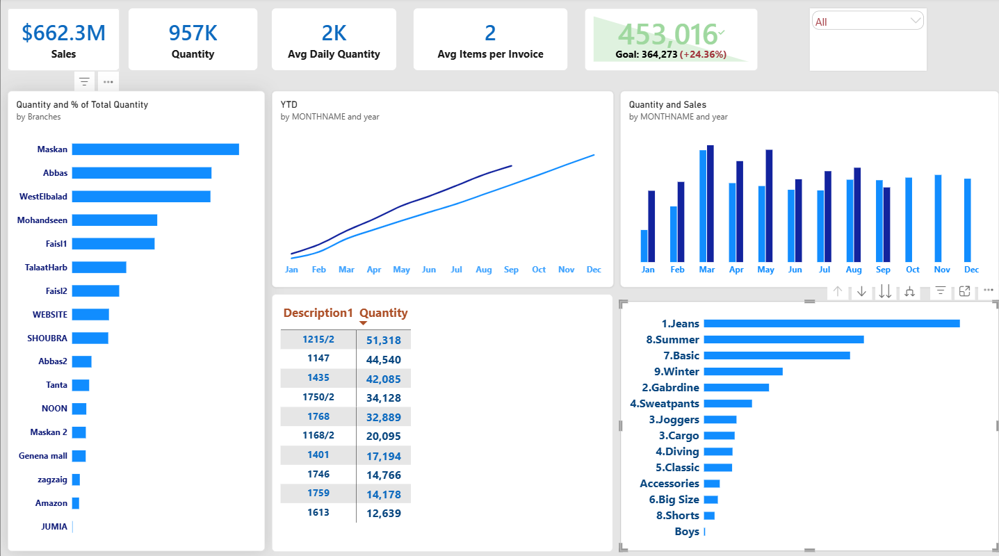

# 📊 Sales & Quantity Performance Analysis Dashboard

## 📊 Dashboard Preview

## 🎯 Project Overview
This Power BI dashboard provides an interactive and comprehensive analysis of retail sales performance, order quantities, and target achievements across multiple branches and categories. It enables decision-makers to track year-to-date (YTD) trends, analyze product demand, and monitor goal progress in real time.

## 🛠️ Key Technical Skills & DAX Applied
* **Power Query Data Transformation:** Standardized branch names (e.g., Maskan, Abbas, Mohandseen, E-commerce channels like NOON & JUMIA), cleaned item descriptions, and prepped relational structures for seamless slicing.
* **DAX Calculations:**
  * **Sales & Volume Aggregates:** Formulated core measures for sum of sales, total quantity, and invoice averages.
  * **Goal Tracking Metrics:** Created dynamic logic to compare actual volume against set goals and determine percentage variance (`+24.36%`).
  * **Time Intelligence Analysis:** Built YTD growth curves comparing current performance against prior year monthly trends (Jan – Dec).
  * **Category & Branch Distributions:** Calculated proportional shares (`% of Total Quantity`) across physical stores and online marketplaces.

## 💡 Key Business Insights
* **Top Branches:** **Maskan**, **Abbas**, and **WestElbalad** lead total volume contribution across physical locations.
* **Top Product Categories:** **Jeans**, **Summer**, and **Basic** lines are the primary revenue drivers.
* **Omnichannel Performance:** Tracks sales performance across offline retail branches as well as online e-commerce platforms (NOON, Amazon, JUMIA, and official Website).
